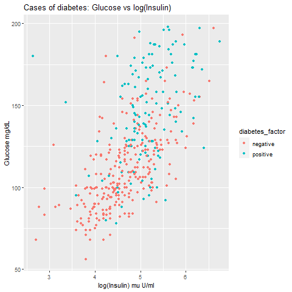

This exam makes up 50% of the mark for this course.

Scheduling:

* Date: Thursday 01/08/2024
* Start time: 9.30am
* Duration: 3 hours

Examination conditions:

* This exam is to be completed under open-book conditions.
You may consult your notes, teaching material, relevant online resources, etc.
**You may not make use of any AI tools.**
* You are welcome to make use of R libraries which we have taught as part of the course.
If you do make use of R libraries then the code to load those libraries must be included somewhere within your question answers.
* All work submitted must be your own.
All forms of communication and messaging during the exam are strictly prohibited, and violations will be dealt with in accordance with UCL policy.
* You may work on the UCL computers, or on your own device.
If you choose to work on your own device then you take responsibility for any technical issues.
* At the end of the exam you will have a short time to upload the file you have produced to Moodle for marking.

Notes

* Partial marks may be awarded for code sections which have been completed, but which are non-functional.
* Marks for questions are indicative, and may be transformed to generate a final grade.

# Question A

The file ```cafe.csv``` contains data on the sales of items in a cafe that opens on Mondays to Fridays.
Sales values are recorded as ```NA``` on days for which the cafe is closed.

Variables within the dataset are:

* ```date``` The date to which the information relates
* ```day``` Day of the week, encoded as numerical values
* ```pizza``` Number of pizza slices sold per day
* ```wraps``` Number of wraps sold per day
* ```pasta``` Number of pasta portions sold per day
* ```dessert``` Number of desserts sold per day
* ```fruitcup``` Number of fruit cups sold per day
* ```chips``` Number of bags of chips sold per day
* ```juice``` Number of assorted bottled juices sold each day
* ```soda``` Number of cups of soda sold each day
* ```coffee```Number of cups of coffee sold each day
* ```daily_sales``` Total dollar sales each day
* ```temp``` Maximum daily temperature (degrees Fahrenheit) each day
* ```humidity``` Minimum daily humidity (percentage) each day
* ```windspeed``` Maximum windspeed (miles per hour) recorded each day
* ```rainfall``` Total daily rainfall (inches) each day

## Part 1

State your student number.
KVGH5
0 marks


## Part 2

Load the contents of the ```cafe.csv``` file into a dataframe.

1 mark

```{r}
cafe <- read.csv("cafe.csv")
```

If you are unable to complete this task then you can achieve the same effect by running the code below.

```{r}
load("cafe.Rda")
```

<span style="color: red;">
For marking use only: <br>
/1 <br>
</span>

## Part 3

Determine the number of rows in the dataframe.

1 mark

```{r}
nrow(cafe)
```

<span style="color: red;">
For marking use only: <br>
/1 <br>
</span>

## Part 4

Display the names of the dataframe columns.

1 mark

```{r}
colnames(cafe)
```

<span style="color: red;">
For marking use only: <br>
/1 <br>
</span>

## Part 5

Edit the dataframe so that the column ```temp``` is renamed to ```temperature```.

1 mark

```{r}
library(tidyverse)

cafe = cafe%>%
        rename(temperature = temp)

head(cafe)
```

<span style="color: red;">
For marking use only: <br>
/1 <br>
</span>

## Part 6

Drop all rows with ```NA``` values and calculate the number of rows removed.

2 marks

```{r}
cafe1 = cafe %>%
  drop_na()

nrow(cafe) - nrow(cafe1)

```

<span style="color: red;">
For marking use only: <br>
/2 <br>
</span>

## Part 7

Edit the dataframe to remove the ```date``` column.

1 mark

```{r}
cafe = cafe%>%
  drop_na()%>%
  select(-date)
head(cafe)

```

<span style="color: red;">
For marking use only: <br>
/1 <br>
</span>

## Part 8

The column ```day``` stores the weekday as an integer using the following mapping:

* 1 for ```mon```
* 2 for ```tues```
* 3 for ```wed```
* 4 for ```thurs```
* 5 for ```fri```

Adjust the dataframe so that ```day``` uses the names given above in a factor type column.

3 marks

```{r}
cafe = cafe %>%
  mutate(day = factor(day, levels=c(1:5), labels=c("mon","tues","wed","thurs","fri")))
  
```

<span style="color: red;">
For marking use only: <br>
/3 <br>
</span>

## Part 9

Add a column ```drinks``` to your dataframe which totals the number of drinks (juice and soda and coffee) sold each day.

2 marks

```{r}
cafe = cafe%>%
  mutate(drinks = juice+soda+coffee)
head(cafe)
```

<span style="color: red;">
For marking use only: <br>
/2 <br>
</span>

## Question B

Load the ```cafe_data.Rda``` file into R using the below code.

```{r}
load("cafe_data.Rda")
```

This file contains the dataframe ```cafe_data```, which is the result of successful completion of Question 1 but without inclusion of the drinks column.

## Part 1

Calculate the total value of sales across the entire time period.

1 mark

```{r}
sum(cafe_data$daily_sales)
```

<span style="color: red;">
For marking use only: <br>
/1 <br>
</span>

## Part 2

Calculate the highest number of coffees sold in a single day.

1 mark

```{r}
max(cafe_data$coffee)
```

<span style="color: red;">
For marking use only: <br>
/1 <br>
</span>

## Part 3

Calculate the mean value of sales on each Monday

1 mark

```{r}
monday = cafe_data%>%
  filter(day == "mon")
  
sum(monday$daily_sales)/nrow(monday)

```

<span style="color: red;">
For marking use only: <br>
/1 <br>
</span>

## Part 4

Calculate the mean value of sales on each Friday

1 mark

```{r}
friday = cafe_data%>%
  filter(day == "fri")
  
sum(friday$daily_sales)/nrow(friday)
```

<span style="color: red;">
For marking use only: <br>
/1 <br>
</span>

## Part 5

Perform a $t$-test to test the hypothesis that the average daily sales differ between a Monday and a Friday.

1 mark

```{r}

cafe_mf = cafe_data %>%
  filter(day == "mon" | day == "fri")

t.test(daily_sales ~ day, data=cafe_mf)
```

<span style="color: red;">
For marking use only: <br>
/1 <br>
</span>

## Part 6

The results of your $t$-test should be:
```
	Welch Two Sample t-test

data: ...
t = 1.7339, df = 8.1744, p-value = 0.1204
alternative hypothesis: true difference in means is not equal to 0
95 percent confidence interval:
 -9.212902 65.904013
sample estimates:
mean of x mean of y 
 122.3456   94.0000
```

Interpret the result of the $t$-test against the hypothesis on a significance level of 0.05.

1 mark

As the p-value is greater than 0.05, we reject the null hypothesis that there is no difference in the average daily sales  between a Monday and a Friday as there is sufficient evidence to conclude the difference.

<span style="color: red;">
For marking use only: <br>
/1 <br>
</span>

## Part 7

Write R code to examine the dataset and display the maximum and minimum temperatures over the recorded period.

1 mark

```{r}
max(cafe_data$temperature)
min(cafe_data$temperature)
```

<span style="color: red;">
For marking use only: <br>
/1 <br>
</span>

## Part 8

Fit three simple linear regression models:

* Model 1 to predict sales of chips using temperature
* Model 2 to predict sales of coffee using temperature
* Model 3 to predict sales of soda using temperature

2 marks

```{r}
model1 = lm(temperature~chips, data=cafe_data)
model2 = lm(temperature~coffee, data=cafe_data)
model3 = lm(temperature~soda, data=cafe_data)
```

<span style="color: red;">
For marking use only: <br>
/2 <br>
</span>

## Part 9

Display overviews of the model results for each of the three models

1 mark

```{r}
summary(model1)
summary(model2)
summary(model3)
```

<span style="color: red;">
For marking use only: <br>
/1 <br>
</span>

## Part 10

Explain how we can interpret the value and significance of the coefficient of temperature in each of the three models.

3 marks

model1: an increase in sales of chips by one unit decreases the temperature by 0.374.
model2: an increase in sales of coffee by one unit decreases the temperature by 0.871.
model3: an increase in sales of soda by one unit increases temperature by 0.615.

<span style="color: red;">
For marking use only: <br>
/3 <br>
</span>

## Part 11

Use the fitted model to predict the number of coffees sold on days when the temperature is 30 degrees Fahrenheit and on days when the temperature is 80 degree Fahrenheit.

2 marks

```{r}
library(tidyverse)
new <- cafe_data %>%
  filter(temperature == 30 | temperature == 80)

predict = predict(model2, new)
predict
```

<span style="color: red;">
For marking use only: <br>
/2 <br>
</span>

# Question C

We continue working with the dataset from Question B.

If you would like to reload this data, you can run the following code.

```{r}
load("cafe_data.Rda")
```

In this question we try to predict pizza sales using the other columns in the dataframe.

## Part 1

Write code to display the frequency table for daily pizza sales.

1 mark

```{r}
cafe_data %>%
  group_by(pizza)%>%
  summarise(n=n())

```

<span style="color: red;">
For marking use only: <br>
/1 <br>
</span>

## Part 2

Build a linear regression model to predict pizza sales from the other columns using forward stepwise selection until an optimal model is reached via the AIC criterion.

3 marks

```{r}
#install.packages("MASS")
library(MASS)
library(tidyverse)
select <- dplyr::select

model_min <- lm(pizza ~ 1, data=cafe_data )
model_max <- lm(pizza ~ . , data=cafe_data )
scp <- list(lower = model_min, upper = model_max)

pizza_model <- stepAIC(model_min,
                      direction = "both",
                      scope = scp
                      )


```

If you are unable to complete this question you are able to generate the resulting model using the following code:

```{r}
lm_step <- lm(pizza ~ day + humidity + dessert + daily_sales + soda + windspeed, data = cafe_data)
```

<span style="color: red;">
For marking use only: <br>
/3 <br>
</span>

## Part 3

Produce the diagnostic plots associated with the stepwise model.

Why is the observation from row 8 labelled in the final plot?

1 mark

```{r}
plot(pizza_model)
```

As row 8 observation is an outlier and causes the deviation to be greater due to higher error.


<span style="color: red;">
For marking use only: <br>
/1 <br>
</span>

## Part 4

Write an R command to display the data associated with row 8.

1 mark

```{r}
rownames(cafe_data) = c(1:43)
cafe_data[8,]
```

<span style="color: red;">
For marking use only: <br>
/1 <br>
</span>

## Part 5

Do you feel that row 8 should be considered an outlier to the rest of the dataset?

Explain your answer.

1 mark
Yes as zero pizzas are sold on that day which is unusual as pizza sales have never been zero in other days.


<span style="color: red;">
For marking use only: <br>
/1 <br>
</span>

## Part 6

Write R code which uses the residuals from the fitted model to calculate the RSS value for the fit.

You should find this to be approximately 93.59.

1 mark

```{r}
res = pizza_model$residuals
RSS = sum(res^2)
RSS
```

<span style="color: red;">
For marking use only: <br>
/1 <br>
</span>

## Part 7

Calculate the RMSE of the fit using $$estimated\ RMSE = \sqrt{\frac{RSS}{43-10}}$$.

(If you hover your cursor over the expression above it should render it for you as a mathematical equation.
If it doesn't you can see it in the html version of this exam.)

1 mark

```{r}

RMSE = sqrt(RSS / (43-10))
RMSE
```

<span style="color: red;">
For marking use only: <br>
/1 <br>
</span>

## Part 8

The number 43 in the formula above refers to the number of rows.

What does the other number refer to?

The other number could be the number of the parameter estimated, including the constant.

1 mark


<span style="color: red;">
For marking use only: <br>
/1 <br>
</span>

## Part 9

Which one of MSE (mean squared error), RMSE (root mean squared error), TSS (total sum of squares) or RSS (residual sum of squares) is of most use to someone considering the accuracy of a prediction produced by the model?

1 mark

RMSE. The standard error of the coefficients can be used to measure the reliability of a variable's contribution to a model.


<span style="color: red;">
For marking use only: <br>
/1 <br>
</span>

## Part 10

Use R to build a simple linear regression model which predicts pizza sales using ```day``` as a single predictor.

This should generate a table of coefficient estimates like:
```
Coefficients:
            Estimate Std. Error t value Pr(>|t|)    
(Intercept)   3.5556     0.6579   5.404 3.73e-06 ***
daytues       3.1444     0.9069   3.467  0.00132 ** 
daywed        1.4444     0.9069   1.593  0.11949    
daythurs      2.3194     0.9591   2.418  0.02049 *  
dayfri       -1.3889     1.0402  -1.335  0.18977    
```

1 mark

```{r}
pizza_day = lm(pizza~day, data=cafe_data )
summary(pizza_day)
```

<span style="color: red;">
For marking use only: <br>
/1 <br>
</span>

## Part 11

Examine the coefficients.
How can we interpret the meaning of these values?

2 marks

For tuesdays, the average increase in pizza sales will be by 3.14
For wednesdays, the average increase in pizza sales will be by 1.44
For thursdays, the average increase in pizza sales will be by 2.32
For fridays, the average decrease in pizza sales will be by 1.39

<span style="color: red;">
For marking use only: <br>
/2 <br>
</span>

## Part 12

Use R to compare the performance of the model for pizza sales with just ```day``` as a covariate to the model obtained via stepwise selection using an ANOVA test.

This should produce the following output:
```
Analysis of Variance Table

Model 1: pizza ~ day
Model 2: pizza ~ day + humidity + dessert + daily_sales + soda + windspeed
  Res.Df     RSS Df Sum of Sq      F   Pr(>F)   
1     38 148.031                                
2     33  93.588  5    54.443 3.8394 0.007498 **
---
Signif. codes:  0 ‘***’ 0.001 ‘**’ 0.01 ‘*’ 0.05 ‘.’ 0.1 ‘ ’ 1
```

1 mark

```{r}
anova(pizza_day, pizza_model)
```

<span style="color: red;">
For marking use only: <br>
/1 <br>
</span>

## Part 13

Interpret the result of the ANOVA test with reference to the coefficients of the additional predictors included in the larger model.

1 mark

By adding more predictors in the larger model did improve the model as the p-value <0.05 which makes it stastically more significant.

<span style="color: red;">
For marking use only: <br>
/1 <br>
</span>

## Part 14

Explain why, even though the performance of the larger model is better, it is of no practical purpose for predicting pizza sales.

There could be overfitting with more factors, performance of training data does not translate to real world performance hence making it not practical.

1 mark


<span style="color: red;">
For marking use only: <br>
/1 <br>
</span>

## Part 15

Why do we use cross-validation methods to compare models when we already have estimates like R-squared, adjusted R-squared and estimated RMSE to measure performance?

2 marks

When we look at model performance we need to avoid overestimating performance due to overfitting of training data.
Cross Validation, or CV, is the standard method to do this.
Cross-validation prevents overfitting by maximizes the use of limited training data by splitting data into k-folds for training and validating
It is also useful when the size of our data set is limited. 

<span style="color: red;">
For marking use only: <br>
/2 <br>
</span>

## Part 16

When performing k-fold cross-validation using the ```cvFit``` function we can provide an argument ```R```.

Explain what this argument does, and why it is useful to make use of it.

2 marks

cvFit gives the RMSE value. 
We can make the function run a number of repeats, each time splitting the data differently into k-folds. We can then look at the range of performance estimates from each repeat, to get an idea of the error in our performance estimate.


<span style="color: red;">
For marking use only: <br>
/2 <br>
</span>

## Part 17

When performing k-fold cross-validation on this dataset what is the maximum number of folds which we could use?

1 mark

43 : nrow(cafe_data)

<span style="color: red;">
For marking use only: <br>
/1 <br>
</span>

## Part 18

Perform k-fold cross-validation on the following models with ```R=20``` and 5 folds.
Include a suitable command to ensure that your analysis is reproducible.

* Model 1: predict the number of pizza sales based upon the day of the week
* Model 2: predict the number of pizza sales based upon the day of the week and the temperature

You should expect results which are similar, but not necessarily identical, to:

* Model 1: RMSE of 2.052 and standard error of 0.151
* Model 2: RMSE of 2.130 and standard error of 0.120

4 marks

```{r}
set.seed(1)
#install.packages("cvTools")
library(cvTools)

model_1 = lm(pizza~ day, data=cafe_data)
model_2 = lm(pizza~ day + temperature, data=cafe_data)
cv1 = cvFit(model_1, data=cafe_data, y=cafe_data$pizza, K=5, R = 20)
cv1
cv1$se
cv2 = cvFit(model_2, data=cafe_data, y=cafe_data$pizza, K=5, R = 20) 
cv2
cv2$se


```

<span style="color: red;">
For marking use only: <br>
/4 <br>
</span>

## Part 19

Which of the two models is the best to use for predicting pizza sales?
Explain your reasoning.

1 mark

The second model is the best. As it has a lower CV value indicating a more precise estimate.

<span style="color: red;">
For marking use only: <br>
/1 <br>
</span>

# Question D

Load the ```db_all.Rda``` file into R using the below code.

```{r}
load("db_all.Rda")
```

This file contains the dataframe ```db_all```, measurements for a number of individuals related to their health.

Variables within the dataset are:

* ```pregnancies``` The number of times which the individual has been pregnant
* ```glucose``` Plasma glucose concentration over 2 hours in an oral glucose tolerance test
* ```blood_pressure``` Diastolic blood pressure (mm Hg)
* ```triceps``` Triceps skin fold thickness (mm)
* ```insulin``` 2-Hour serum insulin (mu U/ml)
* ```log_insulin``` Natural logarithm of ```insulin```
* ```bmi``` Body mass index (weight in kg/[height in m]^2)
* ```pedigree``` Result of a calculation related to diabetes amongst relatives
* ```age``` Age (years)
* ```glucagon``` Measured level of glucagon (ug/ml)
* ```diabetes_numeric``` Did the subject go on to develop diabetes in the next five years (0 representing negative, 1 representing positive)
* ```diabetes_factor``` Did the subject go on to develop diabetes in the next five years (factor with levels ```negative``` and ```positive```)

## Part 1

Make two histogram plots, one showing the distribution of ```insulin``` and another showing the distribution of ```log_insulin```.

2 marks

```{r}
par(mfrow=c(1,2))
db_all %>%
  ggplot(aes(insulin))+
  geom_histogram()

db_all %>%
  ggplot(aes(log_insulin))+
  geom_histogram()
```

<span style="color: red;">
For marking use only: <br>
/2 <br>
</span>

## Part 2

Based upon these plots, would ```insulin``` or ```log_insulin``` be better to use as a predictor in a logistic regression or LDA classification analysis?
Explain your answer.

2 marks

log_insulin will be a better predictor as the distribution is more normal than insulin as LDA makes a few assumptions such as the explanatory or predictor variables must be normally distributed. When the assumption is fulfilled, LDA is expected to produce accurate and good results. Logistic regression does not rely on distributional assumptions in the same sense that discriminant analysis does. However, it will be more stable with a normal distribution.

<span style="color: red;">
For marking use only: <br>
/2 <br>
</span>

## Part 3

Add to the dataframe a column ```log_glucagon``` whose values are the natural logarithm of the recorded glucagon measurements.

1 mark

```{r}
db_all %>%
  mutate(log_glucagon = log(glucagon))
```

<span style="color: red;">
For marking use only: <br>
/1 <br>
</span>

## Part 4

Write R code to create a plot similar to the one below.



(If the command above doesn't automatically display the relevant image you can see it in the html version of this exam, or as a ```diabetes_plot.png``` file in the folder of exam documents.)

4 marks

```{r}
db_all %>%
  ggplot(aes(x=log_insulin, y=glucose, color = diabetes_factor)) +
  labs(y="Glucose mg/dL", x="log(Insulin) mu u/ml")+
  geom_point()
```

<span style="color: red;">
For marking use only: <br>
/4 <br>
</span>

## Part 5

Look at the previous plot.
Do you think that it will be possible to use the logarithm of insulin and glucose measurements to predict whether an individual will develop diabetes in the next five years?
Explain your answer.

2 marks

Yes, as the number of diabetes positive points are clustered on the higher end of log of insulin and glucose measurements where more people have higher intake of insulin and glucose.

<span style="color: red;">
For marking use only: <br>
/2 <br>
</span>

## Part 6

In order to run both logistic regression and K-nearest neighbours methods we will create columns that store rescaled values of ```log_insulin``` and ```glucose```.

This can be achieved by running the code below.

```{r}
db_all$glucose_rs <- scale(db_all$glucose)
db_all$log_insulin_rs <- scale(db_all$log_insulin)
```

Write R code to display the means and standard deviations of these rescaled columns, and comment on how the columns are now scaled.

2 marks

```{r}
mean(db_all$glucose_rs)
mean(db_all$log_insulin_rs)

sd(db_all$glucose_rs)
sd(db_all$log_insulin_rs)
```
The mean are very small and the standard deviation is 1 where approximately 68% of data points fall within one standard deviation of the mean.

<span style="color: red;">
For marking use only: <br>
/2 <br>
</span>

## Part 7

To run our analysis we will create a dataframe ```db_train```, containing a random sample of approximately 80% of the full dataset, and another dataframe ```db_test```, containing the remaining observations.

Write R commands to show how we could create such dataframes from ```db_all```.

3 marks

```{r}
set.seed(1)
n = nrow(db_all)
db_train = sample_n(db_all, size=0.8*n, replace=F)
db_test = setdiff(db_all, db_train)

```

<span style="color: red;">
For marking use only: <br>
/3 <br>
</span>

## Question E

In order to ensure consistency, run the code below to load in the ```db_train``` and ```db_test``` dataframes which have been generated for you and are available in the ```db_prediction.Rda``` file.

```{r}
load("db_prediction.Rda")
```

## Part 1

Perform a logistic regression to predict the diabetes class based upon the ```log_insulin_rs``` and ```glucose_rs``` values for the training data.

2 marks

```{r}
log_model = glm(diabetes_numeric ~ log_insulin_rs + glucose_rs, db_train, family=binomial)

fitted_type_prob = predict(log_model, type='response')
fitted_type = if_else(fitted_type_prob < 0.5, 0, 1)

```

<span style="color: red;">
For marking use only: <br>
/2 <br>
</span>

## Part 2

Use the resulting model to make predictions for the test dataset, ```db_test```, predicting diabetes if the model predicts more than a 0.5 probability for a positive diagnosis.

2 marks

```{r}

db_test$pred <- predict(log_model,type="resp",newdata=db_test)
db_test$pred_d <- if_else(db_test$pred < 0.5, 0, 1)

```

<span style="color: red;">
For marking use only: <br>
/2 <br>
</span>

## Part 3

Create a confusion matrix to indicate performance of the predictions.
You should find the following result:

```
          actual
predicted  negative positive
  negative       51        4
  positive        6       18
```

2 marks

```{r}
table(predicted=db_test$pred_d,actual=db_test$diabetes_factor)
```

<span style="color: red;">
For marking use only: <br>
/2 <br>
</span>

## Part 4

How many total cases of positive diabetes onset were there in the test dataset?

1 mark

```{r}
sum(db_test$diabetes_factor=="positive")

```

<span style="color: red;">
For marking use only: <br>
/1 <br>
</span>

## Part 5

How many of these cases of positive diabetes onset were correctly predicted by the model?

18

1 mark


<span style="color: red;">
For marking use only: <br>
/1 <br>
</span>

## Part 6

Hence, determine the true positive rate, $$TPR = \frac{positive\ cases\ correctly\ identified}{total\ actual\ positive\ cases}$$.

(If you hover your cursor over the expression above it should render it for you as a mathematical equation.
If it doesn't you can see it in the html version of this exam.)

1 mark

```{r}
TPR = 18/22
TPR

```

<span style="color: red;">
For marking use only: <br>
/1 <br>
</span>

## Part 7

Make a new set of predictions, placing people in the positive category if they are predicted to have greater than a probability of 0.2 of being in the group developing diabetes.

Use these predictions to draw up a confusion matrix similar to that obtained previously.
You should obtain the following result:

```
          actual
predicted  negative positive
  negative       25        1
  positive       32       21
```

1 mark

```{r}
db_test$pred1 <- predict(log_model,type="resp",newdata=db_test)
db_test$pred_d1 <- if_else(db_test$pred < 0.2, 0, 1)
table(predicted=db_test$pred_d1,actual=db_test$diabetes_factor)
```

<span style="color: red;">
For marking use only: <br>
/1 <br>
</span>

## Part 8

Show that this increases the true positive rate (TPR).

1 mark

```{r}
TPR1 = 21/22
TPR1

(TPR1-TPR)>0
```

<span style="color: red;">
For marking use only: <br>
/1 <br>
</span>

## Part 9

Suggest a reason why this could be advantageous.

1 mark
```{r}
sum(db_test$pred_d!=db_test$diabetes_numeric)/nrow(db_test)
sum(db_test$pred_d1!=db_test$diabetes_numeric)/nrow(db_test)
```


This optimises prediction accuracy as it increased from 0.127 to 0.418

This reduces the chance of predicting real diabetic patients to be categorised as non-diabetic people as we are including a greater percentage of probability of the people having diabetes.

<span style="color: red;">
For marking use only: <br>
/1 <br>
</span>

## Part 10

In what respect has making this change decreased our measured performance?

1 mark

```{r}

```

Having a smaller sample will mean that not as variable

<span style="color: red;">
For marking use only: <br>
/1 <br>
</span>

## Part 11

We will now try to classify the cases using the k-nearest neighbours method.

From ```db_train``` and ```db_test``` create the following:

* ```db_x_train``` a dataframe containing rescaled predictors for glucose and log(insulin)
* ```db_y_train``` a factor vector containing diabetes classes
* ```db_x_test``` a dataframe containing rescaled predictors for glucose and log(insulin)
* ```db_y_test``` a factor vector containing diabetes classes

4 marks

```{r}
db_x_train = data.frame(glucose = db_train$glucose,
                     log_insulin = db_train$log_insulin)

Y_train = data.frame(diabetes_numeric = db_train$diabetes_numeric)
db_y_train = Y_train$diabetes_numeric

db_x_test = data.frame(glucose = db_test$glucose,
                     log_insulin = db_test$log_insulin)

Y_test = data.frame(diabetes_numeric = db_test$diabetes_numeric)
db_y_test = Y_test$diabetes_numeric
```

If you are unable to do this, you can load these objects directly from the ```db_knn.Rda``` file using the following code:

```{r}
load("db_knn.Rda")
```

<span style="color: red;">
For marking use only: <br>
/4 <br>
</span>

## Part 12

Apply the method of k-nearest neighbours with 5 nearest neighbours to predict the class of the test dataset.

3 marks

```{r}
library(class)
Y_test_predicted <- knn(db_x_train, db_x_test, db_y_train, k=5) 
db_test$predicted <- Y_test_predicted
table(actual = db_test$diabetes_numeric,
      predicted = db_test$predicted)
```

<span style="color: red;">
For marking use only: <br>
/3 <br>
</span>

## Part 13

Calculate the misclassification rate.

1 mark

```{r}

n_correct <- sum(db_test$diabetes_numeric == db_test$predicted)
n_incorrect <- sum(db_test$diabetes_numeric != db_test$predicted)
n_total <- n_correct + n_incorrect
misclassification <- n_incorrect / n_total
misclassification
```

<span style="color: red;">
For marking use only: <br>
/1 <br>
</span>

## Part 14

The following code creates a sequence of 138 numbers running from 1 to 300:

```{r}
k_vals <- c(1:119,seq(120,300,10))
```

Write R code to test the KNN method using these values of K, and plot the resulting misclassification rate against K.

4 marks

```{r warning=FALSE, message=FALSE}
misclassification_rates <- numeric(length(k_vals))
for( i in seq_along(k_vals))
{
   knn_pred = knn(db_x_train, db_x_test, db_y_train, k=k_vals[i])
   misclassification_rates[i] <- mean(knn_pred != db_y_train)
}
error_df <- data.frame(K = k_vals, misclassification_rates = misclassification_rates)
ggplot(error_df, aes(x = K, y = misclassification_rates)) +
  geom_line() +
  geom_point() 
  
```

<span style="color: red;">
For marking use only: <br>
/4 <br>
</span>

## Part 15

Write R code to repeat the KNN analysis across the range of values of K by resampling the training and test groups from the entire sample several times (start with 10 repeated resamples) in order to generate an averaged measure of performance.

Plot the resulting improved performance estimates against K, including +/- standard error limits.

7 marks

```{r}
set.seed(100)
n_repeats = 10
X <- matrix(rnorm(200), 100, 2)
y <- sample(0:1, 100, replace = TRUE)

knn_performance <- function(X, y, k_vals, n_repeats) {
  n_k <- length(k_vals)
  error_rates <- matrix(NA, nrow = n_repeats, ncol = n_k)
  
  for (r in 1:n_repeats) {
    train <- sample(length(y), replace = TRUE)
    test <- setdiff(1:length(y), train)
    train_X <- X[train, ]
    train_y <- y[train]
    test_X <- X[test, ]
    test_y <- y[test]
    
    for (i in seq_along(k_vals)) {
      knn_pred <- knn(train = train_X, test = test_X, cl = train_y, k = k_vals[i])
      error_rates[r, i] <- mean(knn_pred != test_y)
    }
  }
  avg_error_rates <- apply(error_rates, 2, mean)
  std_errors <- apply(error_rates, 2, sd) / sqrt(n_repeats)
  return(list(k_vals = k_vals, avg_error_rates = avg_error_rates, std_errors = std_errors))
}

  knn_results <- knn_performance(X, y, k_vals, n_repeats)
  results_df <- data.frame(
  K = knn_results$k_vals,
  ErrorRate = knn_results$avg_error_rates,
  StdError = knn_results$std_errors
)

ggplot(results_df, aes(x = K, y = ErrorRate)) +
  geom_line() +
  geom_point() +
  geom_errorbar(aes(ymin = ErrorRate - StdError, ymax = ErrorRate + StdError), width = 0.2) +
  labs(x = "K (Number of Neighbors)", y = "Misclassification Rate") +
  ggtitle("Average Misclassification Rate vs. K in KNN (with Standard Errors)")

```

<span style="color: red;">
For marking use only: <br>
/7 <br>
</span>
